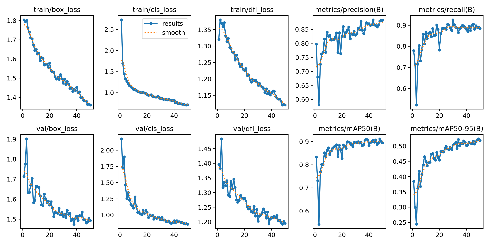
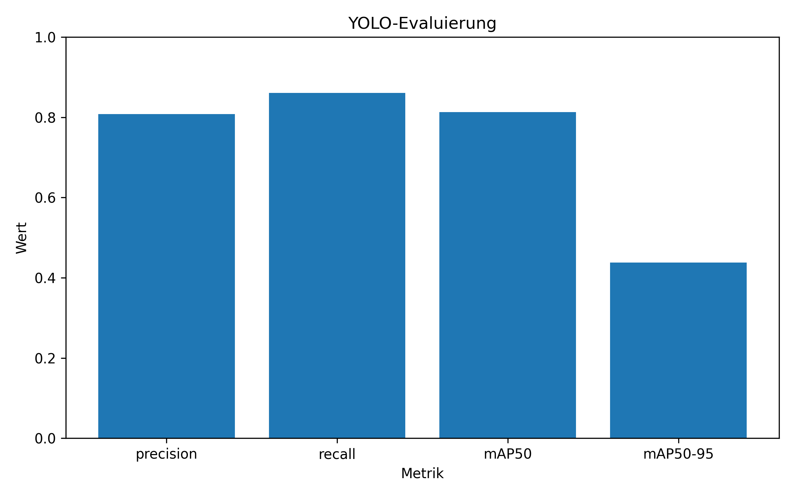
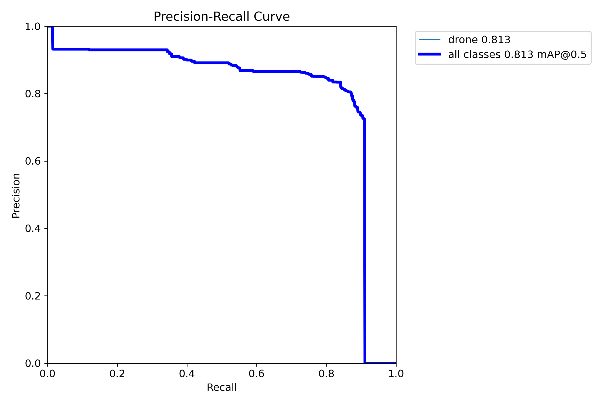
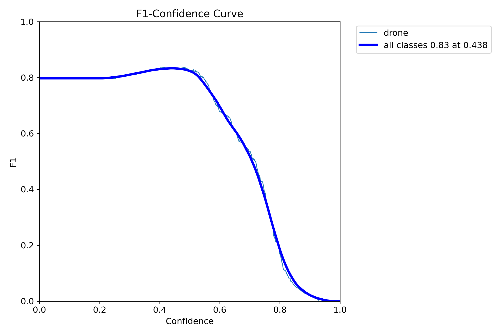
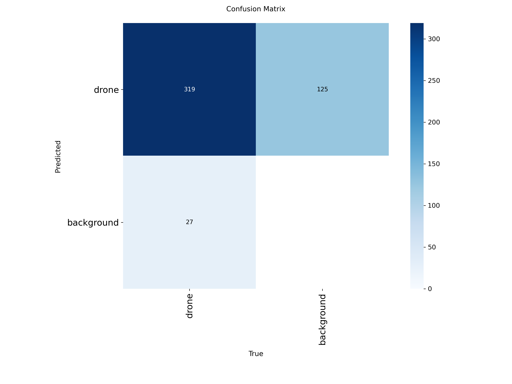
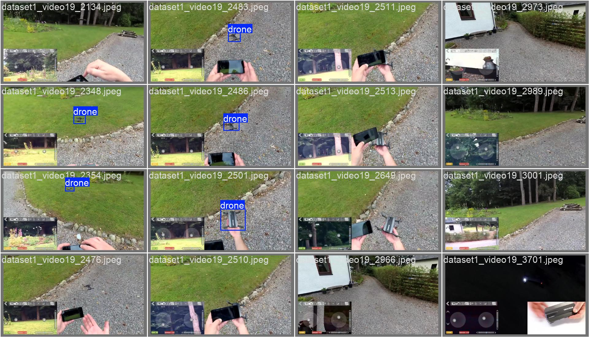
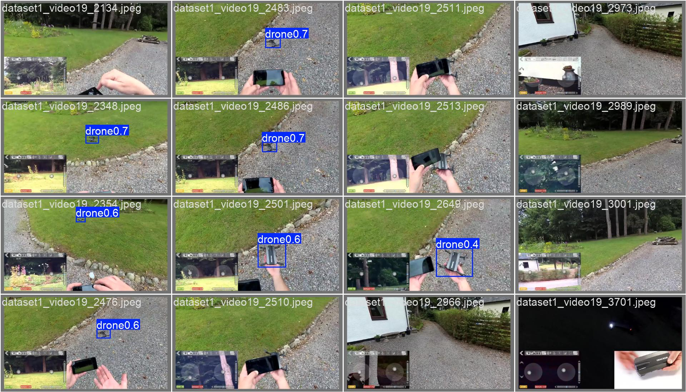
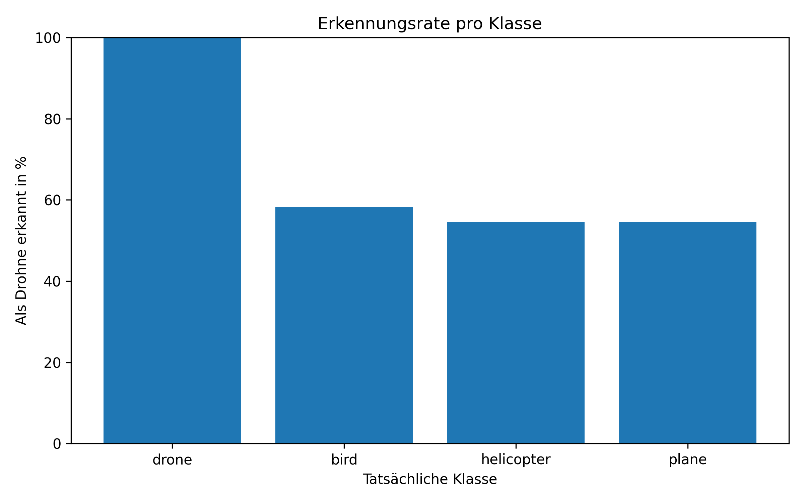
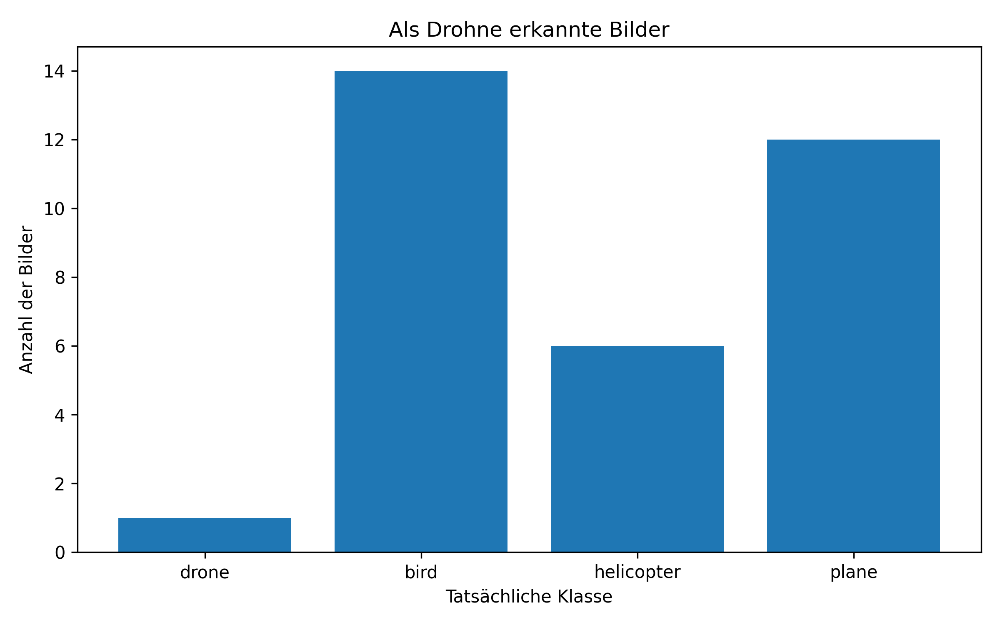
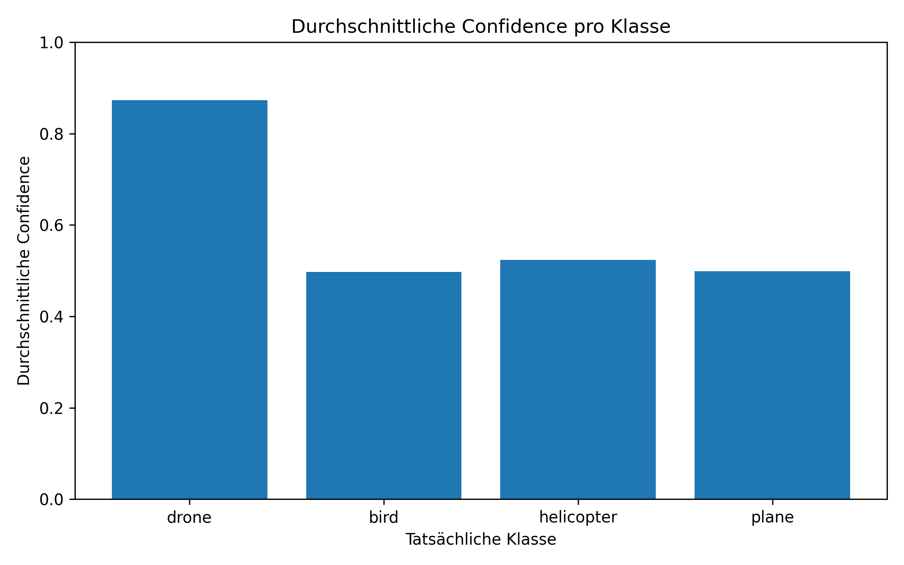

# Deep Learning basierte Drohnenerkennung in Bildern

## Inhaltsverzeichnis

1. [Projektidee](#projektidee)
2. [Related Work](#related-work)
3. [Datensätze](#datensätze)
4. [Vorgehen](#vorgehen)
5. [Training](#training)
6. [Evaluierung](#evaluierung)
7. [Ergebnisse und Auswertung](#ergebnisse-und-auswertung)
8. [Projektstruktur](#projektstruktur)
9. [Installation und Ausführung](#installation-und-ausführung)
10. [Poster](#poster)
11. [Grenzen und Verbesserungsmöglichkeiten](#grenzen-und-verbesserungsmöglichkeiten)
12. [Referenzen](#referenzen)

---

## Projektidee

Ziel dieses Projekts ist die automatische Erkennung von Drohnen in Bildern mithilfe eines Objekterkennungsmodells. Als Grundlage wurde **Ultralytics YOLO11** verwendet. Das trainierte Modell arbeitet als Ein-Klassen-Detektor und kennt ausschließlich die Klasse:

```text
0 = drone
```

Neben der normalen Bewertung der Drohnenerkennung wurde zusätzlich untersucht, welche ähnlich aussehenden Objekte fälschlicherweise als Drohne erkannt werden. Dafür wurden insbesondere die Klassen **Vogel**, **Hubschrauber** und **Flugzeug** betrachtet.

---

## Related Work

YOLO steht für **You Only Look Once** und beschreibt eine Familie von Echtzeit-Objekterkennungsmodellen. Anders als zweistufige Verfahren führt YOLO die Klassifikation und Lokalisierung von Objekten innerhalb eines gemeinsamen neuronalen Netzes aus. Dadurch kann eine hohe Verarbeitungsgeschwindigkeit erreicht werden.

Das ursprüngliche YOLO-Verfahren wurde 2016 von Redmon et al. vorgestellt. Für dieses Projekt wurde die aktuelle Implementierung von **Ultralytics YOLO11** verwendet. Sie bietet unter anderem:

- vortrainierte Modellgewichte,
- Training auf eigenen YOLO-Datensätzen,
- automatische Data Augmentation,
- Berechnung von Precision, Recall und mAP,
- Erzeugung von Confusion Matrices und Kurven,
- einfache Inferenz auf Bildern und Videos.

Gewählt wurde das kleine Modell **YOLO11n**, da es eine gute Balance zwischen Modellgröße, Geschwindigkeit und Genauigkeit bietet und auch auf einer CPU trainiert werden kann.

---

## Datensätze

### Trainingsdatensatz

Für das Training wurde der öffentlich verfügbare Kaggle-Datensatz **Drone Object Detection** von SSHIKAMARU verwendet. Er enthält Bilder von Drohnen und negative Beispiele. Die Annotationen liegen im YOLO-Format vor.

Quelle:

<https://www.kaggle.com/datasets/sshikamaru/drone-yolo-detection>

Das Skript `prepare_dataset.py` teilt die Daten reproduzierbar auf:

| Teilmenge | Anteil |
|---|---:|
| Training | 80 % |
| Validierung | 10 % |
| Test | 10 % |

Durch `random.seed(42)` bleibt die zufällige Aufteilung bei wiederholter Ausführung gleich. Bilder ohne Drohne erhalten eine leere Labeldatei und dienen als negative Beispiele.

Der vorbereitete Datensatz liegt anschließend in:

```text
drone_dataset/
├── images/
│   ├── train/
│   ├── val/
│   └── test/
└── labels/
    ├── train/
    ├── val/
    └── test/
```

### Externer Testdatensatz

Für die zusätzliche Fehlklassifikationsanalyse wurde der Roboflow-Datensatz **birds_helicopters** verwendet. Laut der mitgelieferten Datensatzbeschreibung umfasst er 708 Bilder und wurde im YOLO11-Format exportiert. Er steht unter der Lizenz **CC BY 4.0**.

Quelle:

<https://universe.roboflow.com/jahnavi/birds_helicopters>

Für die Auswertung wurden die Klassen-IDs vereinheitlicht:

```text
0 = drone
1 = bird
2 = helicopter
3 = plane
```

Dieser Datensatz ermöglicht eine gezielte Analyse von Objekten, die aus größerer Entfernung oder bei geringer Bildauflösung einer Drohne ähneln können.

# Hinweis zu den Datensätzen

Die für dieses Projekt verwendeten Datensätze sind **nicht Bestandteil dieses GitHub-Repositories**.

Der Grund dafür ist die sehr große Anzahl an Dateien der Datensätze. Dadurch würde das Repository unnötig groß werden und GitHub ist für die Verwaltung solcher Datensätze nur bedingt geeignet.

Um das Projekt ausführen zu können, müssen die Datensätze daher selbst heruntergeladen und in die entsprechenden Ordner eingefügt werden.

## Benötigte Datensätze

### 1. Drohnendatensatz (Training)

Quelle:
https://www.kaggle.com/datasets/sshikamaru/drone-yolo-detection

Nach dem Download den Datensatz in den Ordner

```
drone_dataset/
```

kopieren.

---

### 2. Datensatz zur Evaluierung

Quelle:
**(Hier den Roboflow-Link einfügen)**

Nach dem Download den Datensatz in den Ordner

```
birds_helicopters.v4i.yolov11/
```

kopieren.

---

### 3. Kombinierter Testdatensatz

Der Ordner `combined_test_yolo` wurde im Rahmen dieses Projekts erstellt und dient ausschließlich der Evaluierung des trainierten Modells. Er kann anhand der beiden oben genannten Datensätze erneut erstellt werden.

### Kombinierter Testdatensatz

Für die offizielle YOLO-Auswertung wurde zusätzlich der Ordner `combined_test_yolo/` erzeugt. Er enthält Bilder aus dem Drohnen-Testdatensatz und aus dem externen Testdatensatz. Da das trainierte Modell nur die Klasse `drone` kennt, werden ausschließlich Bounding Boxes der Klasse 0 übernommen. Bilder ohne Drohne erhalten leere Labeldateien.

Dadurch kann YOLO regulär als Ein-Klassen-Modell evaluiert werden, während die detaillierte Analyse der Verwechslungen separat erfolgt.

---

## Vorgehen

Der Projektablauf bestand aus fünf Schritten:

```text
Kaggle-Datensatz
       │
       ▼
Datensatz vorbereiten
       │
       ▼
YOLO11n trainieren
       │
       ▼
Bestes Modell: best.pt
       │
       ├───────────────────────────┐
       ▼                           ▼
Standard-YOLO-Auswertung     Eigene Fehlklassifikationsanalyse
       │                           │
       └──────────────┬────────────┘
                      ▼
              Gemeinsame Bewertung
```

### 1. Datensatzvorbereitung

Das Skript `prepare_dataset.py` erstellt die Train-, Validierungs- und Testaufteilung und kopiert jeweils Bild und zugehörige Labeldatei in die passenden Ordner.

### 2. Training

Das Skript `train_yolo.py` lädt das vortrainierte Modell `yolo11n.pt` und trainiert es auf dem eigenen Drohnendatensatz.

### 3. Kombinierter Testdatensatz

Das Skript `combined_test_yolo.py` erzeugt einen Testdatensatz für die reguläre YOLO-Validierung. Dabei werden nur Drohnen-Labels übernommen.

### 4. Standardauswertung

Ultralytics berechnet unter anderem:

- Precision,
- Recall,
- mAP50,
- mAP50–95,
- Precision-Recall-Kurve,
- F1-Kurve,
- Confusion Matrix.

### 5. Eigene Fehlklassifikationsanalyse

Das Skript `evaluate_false_positve.py` wertet den externen Testdatensatz Bild für Bild aus. Es vergleicht die tatsächliche Klasse mit der Vorhersage des Ein-Klassen-Modells. Für jede Klasse werden folgende Werte berechnet:

- Anzahl der Bilder,
- Anzahl der Bilder mit mindestens einer Drohnenerkennung,
- Erkennungsrate als Drohne,
- durchschnittliche maximale Confidence,
- annotierte Fehlklassifikationen.

---

## Training

Die tatsächlich verwendeten Trainingsparameter sind in `runs/detect/runs/drone_test_50/args.yaml` dokumentiert.

| Parameter | Wert |
|---|---:|
| Modell | YOLO11n |
| Ausgangsgewicht | `yolo11n.pt` |
| Epochen | 50 |
| Bildgröße | 640 × 640 Pixel |
| Batch Size | 8 |
| Gerät | CPU |
| Optimizer | automatisch durch Ultralytics |
| Validierung | aktiviert |
| Data Augmentation | aktiviert |
| Zufalls-Seed | 0 |

Die Modellgewichte befinden sich in:

```text
runs/detect/runs/drone_test_50/weights/
├── best.pt
└── last.pt
```

`best.pt` enthält das Modell mit der besten Validierungsleistung während des Trainings. `last.pt` entspricht dem Modellzustand nach der letzten Epoche.

Die Trainingsentwicklung ist in folgender Grafik dargestellt:



---

## Evaluierung

### Standardmetriken

**Precision** beschreibt, welcher Anteil der als Drohne vorhergesagten Objekte tatsächlich Drohnen sind. Eine hohe Precision bedeutet wenige False Positives.

**Recall** beschreibt, welcher Anteil der tatsächlich vorhandenen Drohnen erkannt wurde. Ein hoher Recall bedeutet wenige False Negatives.

**mAP50** bewertet die Erkennungsleistung bei einem Intersection-over-Union-Schwellenwert von 0,50.

**mAP50–95** mittelt die Average Precision über mehrere strengere IoU-Schwellen von 0,50 bis 0,95. Dieser Wert ist deshalb normalerweise niedriger als mAP50.

### Eigene Kennzahlen

Die eigene Auswertung verwendet eine Confidence-Schwelle von `0.25`.

Die **Erkennungsrate als Drohne** wird für jede tatsächliche Klasse berechnet:

```text
Anzahl der Bilder mit Drohnenerkennung
-------------------------------------- × 100 %
      Gesamtzahl der Klassenbilder
```

Bei den Nicht-Drohnen-Klassen entspricht diese Rate einer False-Positive-Rate auf Bildebene innerhalb des jeweiligen Testteils.

Die **durchschnittliche Confidence** zeigt, wie sicher das Modell bei seinen Drohnenvorhersagen innerhalb einer Klasse war. Dabei wird pro erkanntem Bild die höchste Confidence verwendet.

---

## Ergebnisse und Auswertung

### Standard-YOLO-Metriken

Die Auswertung auf dem kombinierten Ein-Klassen-Testdatensatz ergab:

| Metrik | Wert |
|---|---:|
| Precision | 0,808 |
| Recall | 0,861 |
| mAP50 | 0,813 |
| mAP50–95 | 0,438 |



Die Precision von ungefähr 0,81 zeigt, dass ein großer Teil der Drohnenvorhersagen korrekt ist. Der Recall von ungefähr 0,86 bedeutet, dass ein hoher Anteil der tatsächlich vorhandenen Drohnen erkannt wird. Der Unterschied zwischen mAP50 und mAP50–95 zeigt, dass die reine Objekterkennung besser ausfällt als die sehr genaue Positionierung der Bounding Boxes bei hohen IoU-Anforderungen.

### Precision-Recall-Kurve



Die Precision-Recall-Kurve zeigt den Zusammenhang zwischen Precision und Recall bei unterschiedlichen Confidence-Schwellen. Eine Kurve nahe der oberen rechten Ecke weist auf eine gute Trennung zwischen korrekten Erkennungen und Fehlalarmen hin.

### F1-Kurve



Der F1-Score kombiniert Precision und Recall. Die Kurve hilft dabei, eine Confidence-Schwelle zu wählen, bei der beide Kennzahlen möglichst ausgewogen sind.

### Confusion Matrix



Die Confusion Matrix stellt korrekte Drohnenerkennungen sowie Verwechslungen mit dem Hintergrund dar. Da das Modell nur eine Objektklasse kennt, kann die Standardmatrix jedoch nicht zeigen, ob ein False Positive beispielsweise durch einen Vogel, einen Hubschrauber oder ein Flugzeug verursacht wurde.

### Vergleich von Ground Truth und Vorhersage

**Ground Truth:**



**Vorhersage:**



Diese Beispiele zeigen, wie die vorhergesagten Bounding Boxes mit den tatsächlichen Annotationen verglichen werden.

### Eigene Fehlklassifikationsanalyse

Die Auswertung des externen Testteils ergab:

| Tatsächliche Klasse | Bilder | Als Drohne erkannt | Erkennungsrate | Durchschnittliche Confidence |
|---|---:|---:|---:|---:|
| Drone | 1 | 1 | 100,00 % | 0,873 |
| Bird | 24 | 14 | 58,33 % | 0,497 |
| Helicopter | 11 | 6 | 54,55 % | 0,524 |
| Plane | 22 | 12 | 54,55 % | 0,499 |







Die Ergebnisse zeigen, dass das Ein-Klassen-Modell bei den betrachteten Nicht-Drohnen-Klassen deutliche Fehlalarme erzeugt. Vögel wurden im Testteil mit 58,33 % am häufigsten als Drohne erkannt. Hubschrauber und Flugzeuge erreichten jeweils eine Rate von 54,55 %.

Die durchschnittlichen Confidence-Werte der Fehlklassifikationen liegen ungefähr zwischen 0,50 und 0,52. Die einzelne echte Drohne wurde dagegen mit einer Confidence von 0,873 erkannt. Dies deutet darauf hin, dass viele Fehlalarme weniger sicher sind als die korrekte Drohnenerkennung. Aufgrund der sehr kleinen Anzahl echter Drohnen im externen Testteil darf dieser Vergleich jedoch nicht verallgemeinert werden.

### Interpretation

Die Verwechslungen sind plausibel, da kleine Flugobjekte in großer Entfernung nur wenige Bildpixel einnehmen. Dadurch gehen feine Merkmale verloren. Silhouetten von Vögeln, Flugzeugen und Hubschraubern können dann ähnliche Konturen wie Drohnen besitzen.

Die Standard-YOLO-Auswertung beantwortet somit vor allem:

> Wie gut erkennt das Modell die trainierte Klasse Drohne?

Die eigene Auswertung beantwortet zusätzlich:

> Welche bekannten Objektarten lösen falsche Drohnenalarme aus?

Beide Auswertungen ergänzen sich. Die Standardmetriken ermöglichen einen allgemeinen Leistungsvergleich, während die eigene Analyse konkrete Schwächen des Modells sichtbar macht.

---

## Projektstruktur

```text
DroneProject/
├── README.md
├── PROJECT_LINKS.md
├── requirements.txt
├── .gitignore
├── Poster.pdf
├── train_yolo.py
├── test_yolo.py
├── prepare_dataset.py
├── combined_test_yolo.py
├── evaluate_false_positve.py
├── data.yaml
├── yolo11n.pt
├── Database1/
├── drone_dataset/
├── birds_helicopters.v4i.yolov11/
├── combined_test_yolo/
├── evaluation_results/
└── runs/
```

Wichtige Inhalte:

| Pfad | Bedeutung |
|---|---|
| `train_yolo.py` | Training des YOLO11n-Modells |
| `prepare_dataset.py` | Aufteilung des Trainingsdatensatzes |
| `combined_test_yolo.py` | Erzeugung des kombinierten Testdatensatzes |
| `evaluate_false_positve.py` | Standardauswertung und eigene False-Positive-Analyse |
| `runs/detect/runs/drone_test_50/` | Trainingsergebnisse und Modellgewichte |
| `evaluation_results/` | CSV-Dateien, Diagramme und annotierte Fehlklassifikationen |
| `Poster.pdf` | Poster zur Projektpräsentation |

---

## Installation und Ausführung

### Voraussetzungen

- Python 3
- Ultralytics
- PyTorch
- pandas
- Matplotlib
- NumPy
- OpenCV

Installation der benötigten Pakete:

```bash
pip install -r requirements.txt
```

### Datensatz vorbereiten

```bash
python prepare_dataset.py
```

### Modell trainieren

```bash
python train_yolo.py
```

### Kombinierten Testdatensatz erstellen

```bash
python combined_test_yolo.py
```

### Auswertung ausführen

```bash
python evaluate_false_positve.py
```

Die Skripte verwenden relative Pfade und sollten deshalb aus dem Hauptordner des Projekts gestartet werden.

---

## Poster

Das Poster zur Projektpräsentation ist im Repository enthalten:

[Poster als PDF öffnen](Poster.pdf)

---

## Grenzen und Verbesserungsmöglichkeiten

Die Ergebnisse müssen unter Berücksichtigung mehrerer Einschränkungen interpretiert werden:

- Das Modell wurde nur auf die Klasse `drone` trainiert.
- Vögel, Hubschrauber und Flugzeuge sind für das Modell keine eigenen Klassen, sondern Hintergrund.
- Der externe Testteil enthält nur eine echte Drohne und ist damit für den Vergleich der Drohnenleistung nicht repräsentativ.
- Die eigene Analyse bewertet, ob auf einem Bild mindestens eine Drohne erkannt wurde. Sie führt keine objektweise Zuordnung jeder Vorhersage zu jeder Ground-Truth-Box durch.
- Die Datenmenge und die Verteilung der Klassen beeinflussen die Aussagekraft der Ergebnisse.
- Das Training wurde auf einer CPU mit dem kleinen YOLO11n-Modell durchgeführt.

Mögliche Verbesserungen sind:

- zusätzliche negative Trainingsbilder mit Vögeln, Flugzeugen und Hubschraubern,
- ein größerer und ausgewogener externer Testdatensatz,
- Training eines Mehrklassenmodells,
- Vergleich von YOLO11n, YOLO11s und YOLO11m,
- Optimierung der Confidence-Schwelle,
- Hyperparameteroptimierung,
- Videoauswertung und Object Tracking,
- Tests unter verschiedenen Wetter-, Licht- und Entfernungssituationen.

---

## Referenzen

[1] J. Redmon, S. Divvala, R. Girshick und A. Farhadi, “You Only Look Once: Unified, Real-Time Object Detection,” in *Proceedings of the IEEE Conference on Computer Vision and Pattern Recognition*, 2016, S. 779–788. doi: 10.1109/CVPR.2016.91.

[2] G. Jocher und J. Qiu, “Ultralytics YOLO11,” Ultralytics, 2024. Verfügbar: <https://docs.ultralytics.com/models/yolo11/>. Zugriff: 30. Juli 2026.

[3] Ultralytics, “Ultralytics YOLO,” GitHub Repository. Verfügbar: <https://github.com/ultralytics/ultralytics>. Zugriff: 30. Juli 2026.

[4] SSHIKAMARU, “Drone Object Detection,” Kaggle Dataset. Verfügbar: <https://www.kaggle.com/datasets/sshikamaru/drone-yolo-detection>. Zugriff: 30. Juli 2026.

[5] Jahnavi, “birds_helicopters,” Roboflow Universe, Version 4. Verfügbar: <https://universe.roboflow.com/jahnavi/birds_helicopters>. Lizenz: CC BY 4.0. Zugriff: 30. Juli 2026.

[6] J. D. Hunter, “Matplotlib: A 2D Graphics Environment,” *Computing in Science & Engineering*, Bd. 9, Nr. 3, S. 90–95, 2007. doi: 10.1109/MCSE.2007.55.

[7] W. McKinney, “Data Structures for Statistical Computing in Python,” in *Proceedings of the 9th Python in Science Conference*, 2010, S. 56–61. doi: 10.25080/Majora-92bf1922-00a.

---

## Autoren

- **Maximilian Steinbauer**
- **Achille Tindo Mbogning**

